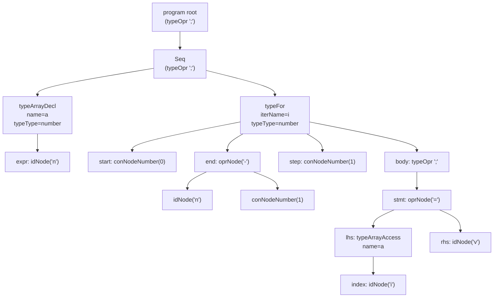

# AST diagram (array decl + for loop)

This corresponds to the VJC snippet:

```vjc
number[] a = new number[n];
for(number i from(0 to n - 1)) {
    a[i] = v;
}
```

## Mermaid (view in VS Code Markdown Preview)



If Mermaid doesn’t render in preview, enable it in VS Code settings:
- `markdown.mermaid.enabled`: `true`

## ASCII (renders everywhere)

```
program root (typeOpr ';')
└── ';' sequence
    ├── typeArrayDecl  name=a  typeType=number
    │   └── size: idNode("n")
    └── typeFor  iterName=i  typeType=number
        ├── start: conNodeNumber(0)
        ├── end: oprNode('-')
        │   ├── idNode("n")
        │   └── conNodeNumber(1)
        ├── step: conNodeNumber(1)
        └── body: typeOpr ';'
            └── oprNode('=')
                ├── lhs: typeArrayAccess name=a
                │   └── index: idNode("i")
                └── rhs: idNode("v")
```
