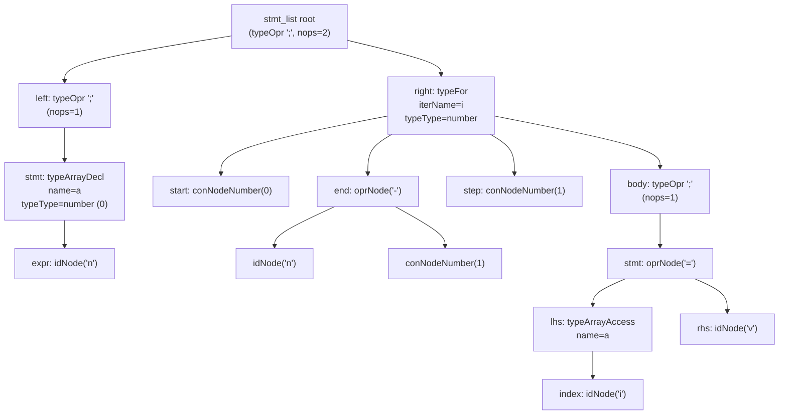

# AST diagram (array decl + for loop)

This corresponds to the VJC snippet (as the contents of a block, e.g. inside `main`):

```vjc
number[] a = new number[n];
for(number i from(0 to n - 1)) {
    a[i] = v;
}
```

## Mermaid (view in VS Code Markdown Preview)



If Mermaid doesn’t render in preview, enable it in VS Code settings:
- `markdown.mermaid.enabled`: `true`

## ASCII (renders everywhere)

```
stmt_list root: oprNode(';', nops=2)
├── left: oprNode(';', nops=1)
│   └── stmt: typeArrayDecl  name=a  typeType=number (0)
│       └── size: idNode("n")
└── right: typeFor  iterName=i  typeType=number (0)
    ├── start: conNodeNumber(0)
    ├── end: oprNode('-')
    │   ├── idNode("n")
    │   └── conNodeNumber(1)
    ├── step: conNodeNumber(1)
    └── body: oprNode(';', nops=1)
        └── stmt: oprNode('=')
            ├── lhs: typeArrayAccess name=a
            │   └── index: idNode("i")
            └── rhs: idNode("v")
```
